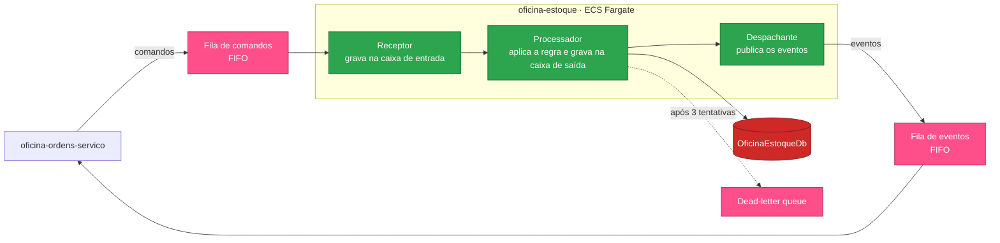

# oficina-estoque

Microsserviço de **peças, insumos, saldos e reservas** de estoque da solução **Oficina**.


---

## Sumário

- [Visão geral](#visão-geral)
- [Ordem de deploy da solução](#ordem-de-deploy-da-solução)
- [Arquitetura](#arquitetura)
- [Autenticação](#autenticação)
- [Endpoints](#endpoints)
- [O que consome e o que publica](#o-que-consome-e-o-que-publica)
- [Configuração](#configuração)
- [Como executar](#como-executar)
- [Validação](#validação)
- [Execução local](#execução-local)
- [Limitações conhecidas](#limitações-conhecidas)
- [Próximas etapas](#próximas-etapas)

---

## Visão geral

A **Oficina** é uma plataforma de gestão de oficina mecânica implantada na AWS e distribuída em **6 repositórios** que compõem um único sistema. O cliente acessa uma **API Gateway HTTP**, que autentica na borda por uma **Lambda authorizer** e encaminha o tráfego, via **VPC Link**, para um **ALB interno** que roteia para três microsserviços **.NET 10 em ECS Fargate**. Os serviços se comunicam por HTTP interno e por filas **SQS FIFO**, e persistem em um **RDS SQL Server** compartilhado.

| Repositório | Responsabilidade | Etapas |
|---|---|:---:|
| [oficina-infra-db](https://github.com/fabianorodrigues/oficina-infra-db-fiap-fase4) | Rede, banco de dados, segredos e estado do Terraform | 1 e 3 |
| [oficina-infra](https://github.com/fabianorodrigues/oficina-infra-fiap-fase4) | Plataforma ECS/ALB e entrada de API | 2, 6 e 7 |
| [oficina-auth-lambda](https://github.com/fabianorodrigues/oficina-auth-lambda-fiap-fase4) | Autenticação por CPF e validação de token | 4 |
| [oficina-cadastro](https://github.com/fabianorodrigues/oficina-cadastro-fiap-fase4) | Clientes, veículos, funcionários e catálogo de serviços | 5 |
| **oficina-estoque** *(este)* | Peças, insumos, saldos e reservas | 5 |
| [oficina-ordens-servico](https://github.com/fabianorodrigues/oficina-ordens-servico-fiap-fase4) | Ordens de serviço, orçamento e saga de pagamento | 5 e 8 |

**Papel deste repositório:** gerencia o catálogo de peças e insumos, os saldos, as movimentações e as reservas. É o participante do lado do estoque na **saga distribuída**: recebe comandos de reserva das ordens de serviço e responde com eventos de resultado.

---

## Ordem de deploy da solução

| # | Repositório | Workflow | Confirmação |
|:---:|---|---|:---:|
| 1 | oficina-infra-db | Database Infrastructure Deploy | `APPLY` |
| 2 | oficina-infra | Platform Deploy | `APPLY` |
| 3 | oficina-infra-db | Database Bootstrap | `BOOTSTRAP` |
| 4 | oficina-auth-lambda | Auth Deploy | `DEPLOY` |
| **5** | cadastro · **oficina-estoque** · ordens-servico | **Deploy** | `DEPLOY` |
| 6 | oficina-infra | Entrypoint Deploy | `APPLY` |
| 7 | oficina-infra | Observability Validate | — |
| 8 | oficina-ordens-servico | AWS E2E Validate | `VALIDATE` |

> [!IMPORTANT]
> Este é um dos três serviços da **etapa 5**, que podem rodar em paralelo. Depende do cluster, do registro de imagem e das **filas SQS** criados na etapa 2, e do banco criado na etapa 3.

---

## Arquitetura

Combina uma API síncrona com um consumidor assíncrono, usando **caixa de entrada e caixa de saída** para garantir processamento exatamente uma vez e entrega confiável, mesmo com reentrega de mensagens.



| Recebe | Publica |
|---|---|
| Reservar estoque | Estoque reservado · Reserva recusada |
| Liberar reserva de estoque | Reserva liberada · Falha ao liberar |

As mensagens são agrupadas pela ordem de serviço, o que preserva a ordem por ordem sem serializar o sistema inteiro. Mensagens de tipo desconhecido seguem para a *dead-letter queue*. Clean Architecture em quatro projetos: **Domain**, **Application**, **Infrastructure** (persistência e mensageria) e **Api**.

---

## Autenticação

O token é validado pelo autorizador da API Gateway, que devolve as *claims* à borda. A API Gateway as converte em cabeçalhos de identidade (`x-oficina-user-id`, `x-oficina-user-cpf`, `x-oficina-user-role`, `x-oficina-user-name`) e os injeta na requisição encaminhada.

Este serviço materializa esses cabeçalhos como *claims* e aplica as políticas de autorização por perfil; apenas `/health` e `/ready` são anônimos. O consumo de mensagens não passa pela camada HTTP e é autorizado pela identidade da task. Os cabeçalhos são confiáveis porque o ALB é interno e o acesso está restrito ao VPC Link. No perfil de desenvolvimento, um modo alternativo aceita cabeçalhos `X-Dev-*` — **ativado apenas em desenvolvimento**.

---

## Endpoints

| Método | Rota | Perfil |
|---|---|---|
| `GET` `POST` | `/api/pecas` | Funcionário ou administrador |
| `GET` `PUT` | `/api/pecas/{id}` | Funcionário ou administrador |
| `GET` `POST` | `/api/insumos` | Funcionário ou administrador |
| `GET` `PUT` | `/api/insumos/{id}` | Funcionário ou administrador |
| `GET` | `/api/estoque` | Funcionário ou administrador |
| `GET` | `/api/estoque/pecas/{id}` · `/api/estoque/insumos/{id}` | Funcionário ou administrador |
| `POST` | `/api/estoque/pecas/{id}/ajustar` · `/api/estoque/insumos/{id}/ajustar` | Funcionário ou administrador |
| `GET` | `/health` · `/ready` | Anônimo |

**Rotas internas**, consumidas apenas pelas ordens de serviço e **não publicadas na API Gateway**: consulta de disponibilidade e de materiais em lote.

> [!NOTE]
> `/ready` neste serviço responde de forma estática e **não verifica a conexão com o banco**.

---

## O que consome e o que publica

### Consome

| Valor | Origem | Criado por |
|---|---|---|
| Cluster, grupo de segurança e subnets das tasks | `/oficina/infra/cluster/name` · `/oficina/infra/ecs/task-security-group-id` · `/oficina/infra/subnets/private/{1,2}` | oficina-infra |
| Registro de imagem, target group e grupo de log | `/oficina/infra/ecr/estoque` · `/oficina/infra/ecs/estoque/{target-group-arn,log-group-name}` | oficina-infra |
| Filas de comandos e eventos + DLQs | `/oficina/infra/sqs/{estoque-comandos,ordens-eventos}[-dlq]/url` | oficina-infra |
| Credenciais de runtime e migração | `/oficina/estoque/{runtime,migration}-db` | oficina-infra-db |

As credenciais são injetadas na task como **ECS secrets**; os endereços das filas, como variáveis de ambiente no deploy.

### Publica

O serviço ECS Fargate no *target group* do ALB, os eventos de resultado de reserva nas filas e o esquema do banco de estoque, aplicado por uma task de migração.

---

## Configuração

Configure em **Settings → Secrets and variables → Actions** do repositório.

| Tipo | Nome | Uso | Obrigatório |
|---|---|---|:---:|
| Secret | `AWS_ACCESS_KEY_ID` · `AWS_SECRET_ACCESS_KEY` · `AWS_SESSION_TOKEN` | Credenciais temporárias da AWS | **Sim** |
| Variable | `AWS_REGION` | Região dos recursos | **Sim** |
| Variable | `ECS_TASK_EXECUTION_ROLE_ARN` | Role de execução das tasks ECS | **Sim** |
| Variable | `ECS_TASK_ROLE_ARN` | Role de aplicação das tasks ECS | **Sim** |

### Papéis IAM das tasks ECS — não provisionados automaticamente

O deploy registra *task definitions* Fargate e reutiliza duas roles IAM que **precisam existir antes da etapa 5**. Nenhum workflow da solução as cria.

| Variable | Trust | Permissões mínimas |
|---|---|---|
| `ECS_TASK_EXECUTION_ROLE_ARN` | `ecs-tasks.amazonaws.com` | `AmazonECSTaskExecutionRolePolicy` e `secretsmanager:GetSecretValue` nos segredos `/oficina/estoque/{runtime,migration}-db` |
| `ECS_TASK_ROLE_ARN` | `ecs-tasks.amazonaws.com` | Ações SQS nas filas de comandos e eventos: `sqs:ReceiveMessage`, `SendMessage`, `DeleteMessage`, `GetQueueAttributes` |

> [!NOTE]
> É o **mesmo par de roles** usado pelo bootstrap e pelos demais serviços. A `ECS_TASK_ROLE_ARN` compartilhada precisa reunir as permissões SQS exigidas por estoque e ordens.

### Variáveis de ambiente da aplicação

Definidas pelo deploy na *task definition*, com os endereços das filas preenchidos no momento do deploy.

| Chave | Valor no ambiente publicado |
|---|---|
| `ConnectionStrings__OficinaEstoqueDb` | Injetada como ECS secret a partir do Secrets Manager |
| `Messaging__Sqs__Enabled` | **Ativado** |
| `Messaging__Sqs__*QueueUrl` | Os quatro endereços de fila |
| `Messaging__Sqs__ConsumerConcurrency` · `MaxMessages` | Fixos em 1, para preservar a ordem |
| `Database__ApplyMigrations` | Desativado — migrações rodam em task própria |

A aplicação recusa-se a iniciar fora de desenvolvimento se faltar a cadeia de conexão ou qualquer um dos quatro endereços de fila.

---

## Como executar

**Actions → Estoque Deploy → Run workflow → `confirmation` = `DEPLOY`**

Roda apenas na branch `main`. Sequência: valida a requisição e as variáveis → descobre cluster, registro de imagem e filas → **confere que as filas são FIFO e têm DLQ associada** → compila e testa → constrói as imagens de runtime e de migração → varredura de vulnerabilidades, que interrompe o deploy em achado alto ou crítico → envia ao ECR → **executa a task de migração (ECS Run Task) e aguarda** → registra a *task definition* de runtime → **cria ou atualiza o serviço ECS** e aguarda ficar estável → confirma destino saudável no ALB.

As imagens são marcadas com o hash do commit. Se a task de migração falhar, o serviço não é atualizado.

---

## Validação

### Pelo Console AWS

| Serviço | O que verificar |
|---|---|
| **ECR** | Repositório de estoque com a imagem do commit publicado |
| **ECS → Serviços** | `oficina-estoque` estável, com a task de runtime em execução |
| **SQS** | Fila de comandos com mensagens sendo consumidas e **DLQ vazia** |

Uma DLQ com mensagens é o principal sinal de falha deste serviço: indica comando que falhou três vezes ou de tipo desconhecido.

### Pela AWS CLI

<details>
<summary>Comandos de validação</summary>

```bash
REGIAO=<sua-regiao>
CLUSTER=$(aws ssm get-parameter --name /oficina/infra/cluster/name \
  --region "$REGIAO" --query 'Parameter.Value' --output text)

aws ecs describe-services --cluster "$CLUSTER" --services oficina-estoque \
  --region "$REGIAO" --query 'services[0].{Status:status,Rodando:runningCount}' --output table

# Profundidade das filas: a DLQ deve permanecer em zero
for q in estoque-comandos estoque-comandos-dlq ordens-eventos ordens-eventos-dlq; do
  URL=$(aws ssm get-parameter --name "/oficina/infra/sqs/$q/url" \
    --region "$REGIAO" --query 'Parameter.Value' --output text 2>/dev/null) || continue
  echo -n "$q -> "
  aws sqs get-queue-attributes --queue-url "$URL" --region "$REGIAO" \
    --attribute-names ApproximateNumberOfMessages \
    --query 'Attributes.ApproximateNumberOfMessages' --output text
done
```

</details>

Após a **etapa 6**, a verificação de saúde também responde pela API pública, em `/health/estoque`.

---

## Execução local

O ambiente local completo — banco, filas emuladas e os três serviços — é orquestrado pelo repositório [oficina-ordens-servico](https://github.com/fabianorodrigues/oficina-ordens-servico-fiap-fase4), que constrói este serviço a partir do diretório vizinho e cria as filas FIFO no emulador. É o caminho recomendado para exercitar a saga de ponta a ponta.

Para trabalhar apenas neste repositório:

```bash
dotnet restore
dotnet build -c Release
dotnet test
```

Os testes cobrem regras de estoque, metadados de persistência e contratos públicos.

---

## Limitações conhecidas

- **Processamento estritamente serial.** Concorrência e lote fixos em 1 para preservar a ordem: consistência custa vazão.
- **Réplica única, sem escala automática**, por decisão de projeto — reforçada por verificação na CI.
- **Cobertura coletada, sem limite mínimo** de qualidade.
- **Sem reprocessamento automático da DLQ.** Mensagens que chegam lá exigem intervenção manual.

---

## Próximas etapas

Publique os demais serviços da **etapa 5**, se ainda não o fez:

- **→ [oficina-cadastro](https://github.com/fabianorodrigues/oficina-cadastro-fiap-fase4)**
- **→ [oficina-ordens-servico](https://github.com/fabianorodrigues/oficina-ordens-servico-fiap-fase4)**

Com os três no ar, siga para a **etapa 6** em [oficina-infra](https://github.com/fabianorodrigues/oficina-infra-fiap-fase4), que publica as rotas na API Gateway.
