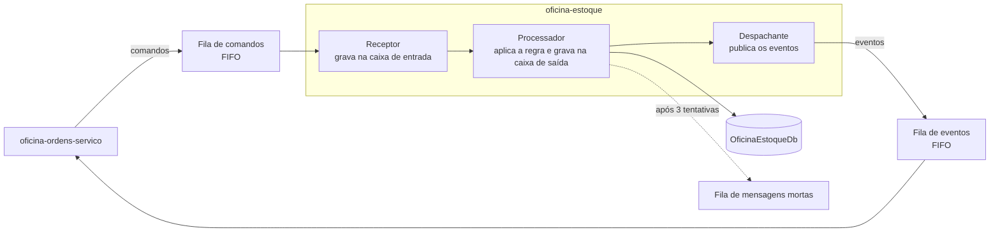

# oficina-estoque

> Microsserviço de peças, insumos, saldos e reservas de estoque da Oficina.
> **.NET 10** · **ASP.NET Core** · **EF Core / SQL Server** · **SQS FIFO** · **EKS**

---

## A solução

A **Oficina** é uma plataforma de gestão de oficina mecânica distribuída em **6 repositórios** que compõem um único sistema na AWS. O cliente acessa uma API Gateway que autentica na borda e encaminha o tráfego para três microsserviços .NET 10 em EKS, que se comunicam por HTTP e por filas SQS FIFO e persistem em um RDS SQL Server compartilhado.

| Repositório | Responsabilidade |
|---|---|
| [oficina-infra-db](https://github.com/fabianorodrigues/oficina-infra-db-fiap-fase4) | Rede, banco de dados, segredos e estado do Terraform |
| [oficina-infra](https://github.com/fabianorodrigues/oficina-infra-fiap-fase4) | Plataforma EKS e entrypoint de API |
| [oficina-auth-lambda](https://github.com/fabianorodrigues/oficina-auth-lambda-fiap-fase4) | Autenticação por CPF e emissão de token |
| [oficina-cadastro](https://github.com/fabianorodrigues/oficina-cadastro-fiap-fase4) | Clientes, veículos, funcionários e catálogo de serviços |
| **oficina-estoque** *(este)* | Peças, insumos, saldos e reservas |
| [oficina-ordens-servico](https://github.com/fabianorodrigues/oficina-ordens-servico-fiap-fase4) | Ordens de serviço, orçamento e saga de pagamento |

---

## Ordem de deploy

| # | Repositório | Workflow | Confirmação |
|---|---|---|---|
| 1 | oficina-infra-db | Database Infrastructure Deploy | `APPLY` |
| 2 | oficina-infra | Platform Deploy | `APPLY` |
| 3 | oficina-infra-db | Database Bootstrap | `BOOTSTRAP` |
| 4 | oficina-auth-lambda | Auth Deploy | `DEPLOY` |
| **5** | cadastro · **oficina-estoque** · ordens-servico | **Deploy** | `DEPLOY` |
| 6 | oficina-infra | Entrypoint Deploy | `APPLY` |
| 7 | oficina-infra | Observability Validate | `VALIDATE` |
| 8 | oficina-ordens-servico | AWS E2E Validate | `VALIDATE` |

> Este repositório é uma das três publicações da **etapa 5**, que podem rodar em paralelo. Depende do cluster, do registro de imagem e das **filas** criados na etapa 2, e do banco criado na etapa 3.

---

## Responsabilidade

- **Catálogo** — peças e insumos, com preço e identificação por tipo de material.
- **Saldos** — quantidade disponível por item, ajustável por operação explícita.
- **Movimentações** — histórico de entradas e saídas.
- **Reservas** — bloqueio de material para uma ordem de serviço, e sua liberação.

É o participante do lado do estoque na saga distribuída: recebe comandos de reserva das ordens de serviço e responde com eventos de resultado.

---

## Arquitetura

O serviço combina uma API síncrona com um consumidor assíncrono, usando **caixa de entrada e caixa de saída** para garantir processamento exatamente uma vez e entrega confiável, mesmo com reentrega de mensagens.



| Recebe | Publica |
|---|---|
| Reservar estoque | Estoque reservado · Reserva recusada |
| Liberar reserva de estoque | Reserva liberada · Falha ao liberar |

As mensagens são agrupadas pela ordem de serviço, o que preserva a ordem por ordem sem serializar o sistema inteiro. Mensagens de tipo desconhecido não são confirmadas e seguem para a fila de mensagens mortas pelo mecanismo nativo da fila.

Clean Architecture em quatro projetos: **Domain**, **Application**, **Infrastructure** (persistência e mensageria) e **Api**.

---

## Autenticação

O token é validado pelo autorizador da API Gateway, que devolve as claims à borda. A API Gateway as converte em cabeçalhos de identidade (`x-oficina-user-id`, `x-oficina-user-cpf`, `x-oficina-user-role`, `x-oficina-user-name`) e os injeta na requisição encaminhada.

Este serviço materializa esses cabeçalhos como claims e aplica as políticas de autorização por perfil. Requisição sem identidade válida é rejeitada pela política padrão, que exige usuário autenticado; apenas `/health` e `/ready` são anônimos. O consumo de mensagens não passa pela camada HTTP e é autorizado pela identidade do pod.

Os cabeçalhos são confiáveis porque o balanceador é interno e o acesso está restrito ao VPC Link — nenhum chamador externo alcança o serviço sem passar pela borda. Manter essa restrição é parte do modelo de segurança.

No perfil de desenvolvimento, um modo alternativo aceita cabeçalhos `X-Dev-*` para simular perfil e usuário sem token. Ele **só é ativado em desenvolvimento**.

---

## Endpoints

| Método | Rota | Perfil |
|---|---|---|
| `GET` `POST` | `/api/pecas` | Funcionário ou administrador |
| `GET` `PUT` | `/api/pecas/{id}` | Funcionário ou administrador |
| `GET` `POST` | `/api/insumos` | Funcionário ou administrador |
| `GET` `PUT` | `/api/insumos/{id}` | Funcionário ou administrador |
| `GET` | `/api/estoque` | Funcionário ou administrador |
| `GET` | `/api/estoque/pecas/{id}` · `/api/estoque/insumos/{id}` | Funcionário ou administrador |
| `POST` | `/api/estoque/pecas/{id}/ajustar` · `/api/estoque/insumos/{id}/ajustar` | Funcionário ou administrador |
| `GET` | `/health` · `/ready` | Anônimo |

**Rotas internas**, consumidas apenas pelas ordens de serviço e **não publicadas na API Gateway**: consulta de disponibilidade e consulta de materiais em lote.

> `/ready` neste serviço responde de forma estática e **não verifica a conexão com o banco**.

---

## Contrato de integração

### Consome

| Valor | Origem | Criado por |
|---|---|---|
| Cluster e namespace | `/oficina/infra/cluster/{name,namespace}` | oficina-infra |
| Registro de imagem | `/oficina/infra/ecr/estoque` | oficina-infra |
| Filas de comandos e eventos | `/oficina/infra/sqs/...` (4 endereços) | oficina-infra |
| Credenciais de banco | `/oficina/estoque/{runtime,migration}-db` | oficina-infra-db |

O deploy confere que as quatro filas são FIFO e têm política de redirecionamento antes de publicar. As credenciais são montadas no pod pelo driver CSI de segredos.

### Publica

Rotas HTTP no cluster, os eventos de resultado de reserva nas filas, e o esquema do banco de estoque, aplicado pelo Job de migração.

---

## Configuração

Configure em **Settings → Secrets and variables → Actions** do repositório.

| Tipo | Nome | Obrigatório |
|---|---|---|
| Secret | `AWS_ACCESS_KEY_ID` · `AWS_SECRET_ACCESS_KEY` · `AWS_SESSION_TOKEN` | **Sim** |
| Variable | `AWS_REGION` | **Sim** |

Não há mais nada a configurar: cluster, registro de imagem, endereços das filas e credenciais são descobertos em tempo de execução a partir do que as etapas anteriores publicaram.

### Variáveis de ambiente da aplicação

Definidas pelo ConfigMap do repositório, com os endereços das filas preenchidos no momento do deploy.

| Chave | Valor no ambiente publicado |
|---|---|
| `ConnectionStrings__OficinaEstoqueDb` | Montada pelo CSI a partir do segredo |
| `Messaging__Sqs__Enabled` | **Ativado** |
| `Messaging__Sqs__*QueueUrl` | Os quatro endereços de fila, obrigatórios fora de desenvolvimento |
| `Messaging__Sqs__ConsumerConcurrency` · `MaxMessages` | Fixos em 1, para preservar a ordem |
| `Database__ApplyMigrations` | Desativado — migrações rodam em Job próprio |

> **Atenção operacional:** com `Messaging__Sqs__Enabled` desativado, os três componentes de mensageria não são registrados e o serviço **para de participar da saga silenciosamente** — a API continua respondendo normalmente. Se as reservas deixarem de ser processadas, verifique essa chave primeiro.

A aplicação recusa-se a iniciar fora do perfil de desenvolvimento se faltar a cadeia de conexão ou qualquer um dos quatro endereços de fila.

---

## Executar pelo GitHub Actions

**Actions → Estoque Deploy → Run workflow → `confirmation` = `DEPLOY`**

Roda apenas na branch `main`. Sequência: valida a requisição e a configuração → descobre cluster, registro de imagem e filas → **confere que as filas são FIFO e têm fila morta associada** → compila e testa → constrói as imagens de runtime e de migração → varredura de vulnerabilidades, que interrompe o deploy em achado alto ou crítico → envia ao registro → aplica os manifestos → executa o Job de migração e aguarda → aplica o Deployment → teste de fumaça por encaminhamento de porta.

As imagens são marcadas com o hash do commit. Se o Job de migração falhar, o Deployment não é atualizado.

---

## Validar

### Pelo Console AWS

| Serviço | O que verificar |
|---|---|
| **ECR** | Repositório de estoque com a imagem do commit publicado |
| **SQS** | Fila de comandos com mensagens sendo consumidas e **fila morta vazia** |
| **EKS → Recursos** | Deployment disponível e Job de migração concluído |

Uma fila morta com mensagens é o principal sinal de falha deste serviço: indica comando que falhou três vezes ou de tipo desconhecido.

### Pela CLI

<details>
<summary>Comandos de validação</summary>

```bash
REGIAO=<sua-regiao>
CLUSTER=$(aws ssm get-parameter --name /oficina/infra/cluster/name \
  --region "$REGIAO" --query 'Parameter.Value' --output text)
aws eks update-kubeconfig --name "$CLUSTER" --region "$REGIAO"

kubectl get deployment,pod -n oficina -l app.kubernetes.io/name=oficina-estoque
kubectl logs -n oficina -l app.kubernetes.io/name=oficina-estoque --tail=50

# Profundidade das filas: a fila morta deve permanecer em zero
for q in estoque-comandos estoque-comandos-dlq ordens-eventos ordens-eventos-dlq; do
  URL=$(aws ssm get-parameter --name "/oficina/infra/sqs/$q/url" \
    --region "$REGIAO" --query 'Parameter.Value' --output text 2>/dev/null) || continue
  echo -n "$q -> "
  aws sqs get-queue-attributes --queue-url "$URL" --region "$REGIAO" \
    --attribute-names ApproximateNumberOfMessages \
    --query 'Attributes.ApproximateNumberOfMessages' --output text
done
```

</details>

Após a **etapa 6**, a verificação de saúde também responde pela API pública, em `/health/estoque`.

---

## Executar e validar localmente

O ambiente local completo — banco, filas emuladas e os três serviços — é orquestrado pelo repositório [oficina-ordens-servico](https://github.com/fabianorodrigues/oficina-ordens-servico-fiap-fase4), que constrói este serviço a partir do diretório vizinho e cria as filas FIFO no emulador. É o caminho recomendado para exercitar a saga de ponta a ponta.

Para trabalhar apenas neste repositório:

```bash
dotnet restore
dotnet build -c Release
dotnet test
```

Os testes cobrem regras de estoque, metadados de persistência e contratos públicos.

---

## Limitações conhecidas

- **Processamento estritamente serial.** Concorrência e tamanho do lote são fixos em 1 para preservar a ordem: o ganho de consistência custa vazão.
- **Réplica única, sem escala automática**, por decisão de projeto — reforçada por verificação na CI, que reprova a introdução de escalador automático.
- **Cobertura coletada mas sem limite mínimo.**
- **Artefatos de compilação versionados.** Diretórios de saída do build estão no repositório e deveriam ser ignorados.
- **Sem reprocessamento automático da fila morta.** Mensagens que chegam lá exigem intervenção manual.

---

## Próxima etapa

Publique os demais serviços da **etapa 5**, se ainda não o fez:

- **→ [oficina-cadastro](https://github.com/fabianorodrigues/oficina-cadastro-fiap-fase4)**
- **→ [oficina-ordens-servico](https://github.com/fabianorodrigues/oficina-ordens-servico-fiap-fase4)**

Com os três no ar, siga para a **etapa 6** em [oficina-infra](https://github.com/fabianorodrigues/oficina-infra-fiap-fase4), que publica as rotas na API Gateway.
