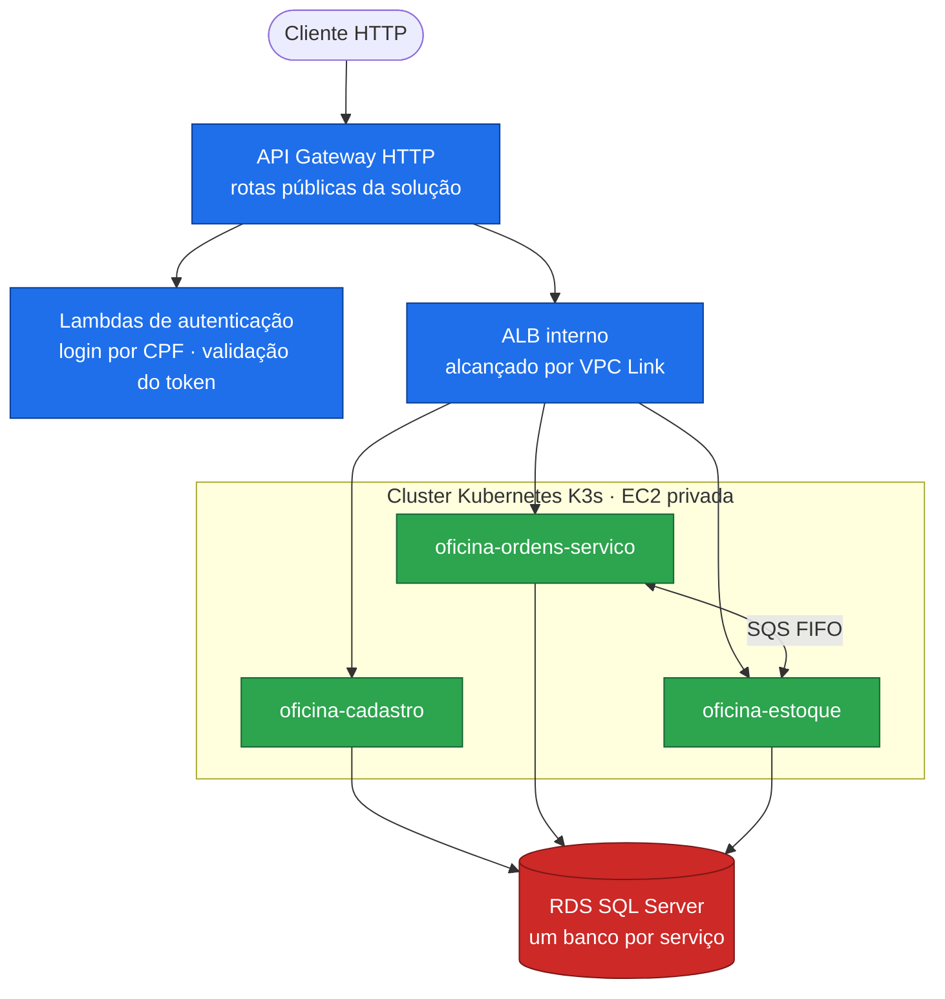
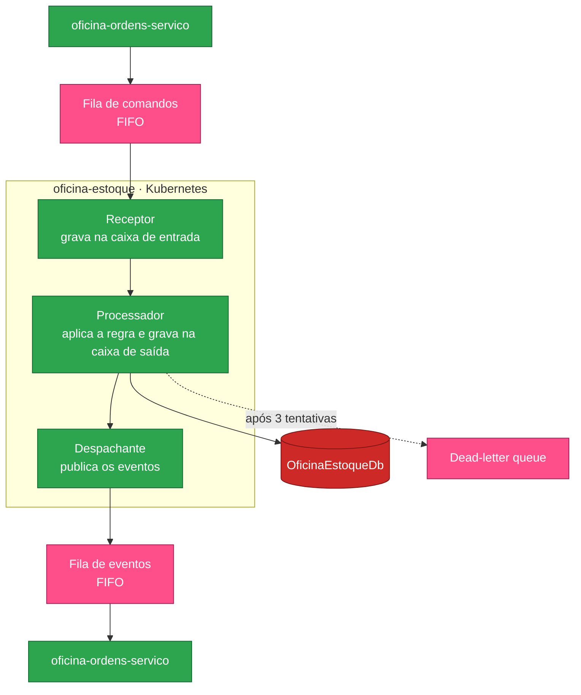

<h1 align="center">Oficina · Estoque</h1>

<p align="center">
  Microsserviço de <strong>peças, insumos, saldos e reservas</strong> da solução <strong>Oficina</strong>,
  e participante do lado do estoque na saga distribuída.
</p>

<p align="center">
  
  
</p>

<p align="center">
  
  
  
  
  
  
</p>

<p align="center">
  <a href="https://jaquelineramosit.github.io/oficina-docs/"></a>
  <a href="https://youtu.be/SYXeLpUZaiA"></a>
</p>

---

## Sumário

- [Documentação e demonstração](#documentação-e-demonstração)
- [Responsabilidade](#responsabilidade)
- [Solução integrada](#solução-integrada)
- [Ordem de deploy](#ordem-de-deploy)
- [Arquitetura](#arquitetura)
- [Endpoints](#endpoints)
- [Pré-requisitos manuais](#pré-requisitos-manuais)
- [Contratos consumidos e publicados](#contratos-consumidos-e-publicados)
- [Como configurar](#como-configurar)
- [Como executar](#como-executar)
- [Como validar](#como-validar)
- [Ambiente local](#ambiente-local)
- [Observabilidade](#observabilidade)
- [Próxima etapa](#próxima-etapa)

---

## Documentação e demonstração

A solução **Oficina** tem documentação oficial e um vídeo de demonstração que percorrem a **configuração, o provisionamento e a validação** de ponta a ponta, na sequência das 11 etapas.

| Recurso | Conteúdo |
|---|---|
| **[Documentação oficial](https://jaquelineramosit.github.io/oficina-docs/)** | Guia completo da solução: arquitetura, configuração dos repositórios, provisionamento na AWS e validação do ambiente publicado |
| **[Vídeo de demonstração](https://youtu.be/SYXeLpUZaiA)** | Execução guiada da configuração, do provisionamento e da validação da solução |

---

## Responsabilidade

Gestão de materiais da oficina, publicada na **etapa 7**.

| Domínio | Conteúdo |
|---|---|
| Peças e insumos | Catálogo, cadastro e manutenção |
| Saldos e movimentações | Posição atual e ajustes de entrada e saída |
| Reservas | Bloqueio e liberação de material para uma ordem de serviço |

É o participante do lado do estoque na **saga distribuída**: recebe comandos de reserva das ordens de serviço e responde com eventos de resultado.

| Recebe | Responde |
|---|---|
| Reservar estoque | Estoque reservado · Reserva recusada |
| Liberar reserva de estoque | Reserva liberada · Falha ao liberar |

---

## Solução integrada

A **Oficina** é uma plataforma de gestão de oficina mecânica implantada na AWS e distribuída em **6 repositórios que formam um único sistema**. O cliente acessa uma **API Gateway HTTP**, autenticada na borda por **Lambdas**; o tráfego segue por **VPC Link** até um **ALB interno**, que roteia para três microsserviços **.NET 10** em **Kubernetes (K3s)**. Os serviços conversam por HTTP interno e por **filas SQS FIFO**, e persistem em um **RDS SQL Server** com um banco isolado por serviço.


```mermaid
flowchart TB
    Cliente([Cliente HTTP])
    Gateway["API Gateway HTTP<br/>rotas públicas da solução"]
    Auth["Lambdas de autenticação<br/>login por CPF · validação do token"]
    ALB["ALB interno<br/>alcançado por VPC Link"]

    subgraph Cluster["Cluster Kubernetes K3s · EC2 privada"]
        direction LR
        Cadastro["oficina-cadastro"]
        Ordens["oficina-ordens-servico"]
        Estoque["oficina-estoque"]
    end

    Banco[("RDS SQL Server<br/>um banco por serviço")]

    Cliente --> Gateway
    Gateway --> Auth
    Gateway --> ALB
    ALB --> Cadastro
    ALB --> Ordens
    ALB --> Estoque
    Ordens <-->|"SQS FIFO"| Estoque
    Cadastro --> Banco
    Ordens --> Banco
    Estoque --> Banco

    classDef borda fill:#1f6feb,stroke:#0b3d91,color:#fff
    classDef servico fill:#2da44e,stroke:#166534,color:#fff
    classDef dados fill:#CC2927,stroke:#7a1717,color:#fff
    class Gateway,Auth,ALB borda
    class Cadastro,Ordens,Estoque servico
    class Banco dados
```

| Repositório | Responsabilidade | Etapas |
|---|---|:---:|
| [oficina-infra-db](https://github.com/fabianorodrigues/oficina-infra-db-fiap-fase4) | Rede, banco de dados, segredos, estado do Terraform e administrador inicial | 1 · 3 · 6 |
| [oficina-infra](https://github.com/fabianorodrigues/oficina-infra-fiap-fase4) | Plataforma Kubernetes/ALB, entrada pública da API e observabilidade | 2 · 9 · 10 |
| [oficina-auth-lambda](https://github.com/fabianorodrigues/oficina-auth-lambda-fiap-fase4) | Autenticação por CPF e validação de token na borda | 4 |
| [oficina-cadastro](https://github.com/fabianorodrigues/oficina-cadastro-fiap-fase4) | Clientes, veículos, funcionários e catálogo de serviços | 5 |
| **oficina-estoque** *(este)* | Peças, insumos, saldos e reservas | 7 |
| [oficina-ordens-servico](https://github.com/fabianorodrigues/oficina-ordens-servico-fiap-fase4) | Ordens de serviço, orçamento e saga de pagamento | 8 · 11 |

---

## Ordem de deploy

| # | Repositório | Workflow | Confirmação |
|:---:|---|---|:---:|
| 1 | oficina-infra-db | Database Infrastructure Deploy | `APPLY` |
| 2 | oficina-infra | Platform Deploy | `APPLY` |
| 3 | oficina-infra-db | Database Bootstrap | `BOOTSTRAP` |
| 4 | oficina-auth-lambda | Auth Deploy | `DEPLOY` |
| 5 | oficina-cadastro | Cadastro Deploy | `DEPLOY` |
| 6 | oficina-infra-db | Initial Admin Provision | `PROVISION_ADMIN` |
| **7** | **oficina-estoque** *(este)* | **Estoque Deploy** | `DEPLOY` |
| 8 | oficina-ordens-servico | Ordens Deploy | `DEPLOY` |
| 9 | oficina-infra | Entrypoint Deploy | `APPLY` |
| 10 | oficina-infra | Observability Deploy | `DEPLOY` |
| 11 | oficina-ordens-servico | Collection Postman (manual) | — |

> [!IMPORTANT]
> Depende do cluster, do registro de imagem e das **filas SQS** criados na etapa 2, e do banco criado na etapa 3. Não depende do administrador inicial da etapa 6 para publicar o workload — essa credencial é exigida apenas pela validação funcional da etapa 11.

---

## Arquitetura

Uma API síncrona combinada com um consumidor assíncrono. O padrão **caixa de entrada e caixa de saída** garante processamento exatamente uma vez e entrega confiável mesmo com reentrega de mensagens.


```mermaid
flowchart TB
    OrdensEnvia["oficina-ordens-servico"]
    FilaComandos["Fila de comandos<br/>FIFO"]

    subgraph Servico["oficina-estoque · Kubernetes"]
        direction TB
        Receptor["Receptor<br/>grava na caixa de entrada"]
        Processador["Processador<br/>aplica a regra e grava na caixa de saída"]
        Despachante["Despachante<br/>publica os eventos"]
        Receptor --> Processador --> Despachante
    end

    OrdensEnvia --> FilaComandos
    FilaComandos --> Receptor
    Processador --> Banco[("OficinaEstoqueDb")]
    Processador -.->|"após 3 tentativas"| DLQ["Dead-letter queue"]
    Despachante --> FilaEventos["Fila de eventos<br/>FIFO"]
    FilaEventos --> OrdensRecebe["oficina-ordens-servico"]

    classDef servico fill:#2da44e,stroke:#166534,color:#fff
    classDef dados fill:#CC2927,stroke:#7a1717,color:#fff
    classDef fila fill:#FF4F8B,stroke:#a11d55,color:#fff
    class Receptor,Processador,Despachante,OrdensEnvia,OrdensRecebe servico
    class Banco dados
    class FilaComandos,FilaEventos,DLQ fila
```

As mensagens são agrupadas pela ordem de serviço, o que preserva a ordem por ordem sem serializar o sistema inteiro. Mensagens de tipo desconhecido e comandos que falham três vezes seguem para a *dead-letter queue*, que exige intervenção manual.

Clean Architecture em quatro projetos: **Domain**, **Application**, **Infrastructure** (persistência e mensageria) e **Api**.

### Autenticação

O token é validado pelo autorizador na borda, e a API Gateway injeta as *claims* como cabeçalhos de identidade (`x-oficina-user-id`, `x-oficina-user-cpf`, `x-oficina-user-role`, `x-oficina-user-name`). Este serviço materializa esses cabeçalhos como *claims* e aplica as políticas de autorização por perfil; apenas `/health` e `/ready` são anônimos.

O consumo de mensagens não passa pela camada HTTP e é autorizado pela identidade do próprio workload. No perfil de desenvolvimento existe um modo alternativo, que aceita cabeçalhos `X-Dev-*` para simular usuário sem token.

---

## Endpoints

| Método | Rota | Perfil |
|---|---|---|
| `GET` `POST` | `/api/pecas` | Funcionário ou administrador |
| `GET` `PUT` | `/api/pecas/{id}` | Funcionário ou administrador |
| `GET` `POST` | `/api/insumos` | Funcionário ou administrador |
| `GET` `PUT` | `/api/insumos/{id}` | Funcionário ou administrador |
| `GET` | `/api/estoque` | Funcionário ou administrador |
| `GET` | `/api/estoque/pecas/{id}` · `/api/estoque/insumos/{id}` | Funcionário ou administrador |
| `POST` | `/api/estoque/pecas/{id}/ajustar` · `/api/estoque/insumos/{id}/ajustar` | Funcionário ou administrador |
| `GET` | `/health` · `/ready` | Anônimo |

**Rotas internas** (`/api/internal/...`), consumidas apenas pelas ordens de serviço e **não publicadas na API Gateway**: consulta de disponibilidade e de materiais em lote.

`/health` reflete apenas o processo; `/ready` verifica a conexão com o banco e responde `503` quando ela falha. É esse endpoint que o target group do ALB usa como health check, então o destino só fica saudável com o serviço pronto para atender.

---

## Pré-requisitos manuais

| Pré-requisito | Onde configurar | Comportamento sem configuração |
|---|---|---|
| Credenciais temporárias da AWS | Secrets deste repositório | O workflow falha na autenticação |
| Região da AWS | Variable `AWS_REGION` | O workflow aborta na validação inicial |
| Etapas 2 e 3 concluídas | [oficina-infra](https://github.com/fabianorodrigues/oficina-infra-fiap-fase4) e [oficina-infra-db](https://github.com/fabianorodrigues/oficina-infra-db-fiap-fase4) | O deploy falha ao resolver cluster, filas, registro de imagem ou credenciais |
| Instance profile da EC2 do cluster | Variable `INSTANCE_PROFILE_NAME`, em [oficina-infra](https://github.com/fabianorodrigues/oficina-infra-fiap-fase4#pré-requisitos-manuais) | Nenhum workflow da solução cria ou altera recursos IAM |

**Nenhuma role é passada por este deploy.** Os Pods herdam a role do instance profile da EC2, que precisa permitir: registro no Systems Manager, `ecr:GetAuthorizationToken` e leitura das imagens, `secretsmanager:GetSecretValue` nos segredos `/oficina/estoque/{runtime,migration}-db`, `ssm:GetParameter` com `kms:Decrypt` no prefixo `/oficina/deploy/` e o consumo das filas da solução.

---

## Contratos consumidos e publicados

### Consome

| Valor | Caminho | Criado por |
|---|---|---|
| Node do cluster e namespace | `/oficina/infra/k8s/{instance-id,namespace}` | oficina-infra |
| Registro de imagem | `/oficina/infra/ecr/estoque` | oficina-infra |
| Target group e NodePort | `/oficina/infra/services/estoque/{target-group-arn,node-port}` | oficina-infra |
| Filas de comandos, eventos e DLQs | `/oficina/infra/sqs/{estoque-comandos,ordens-eventos}[-dlq]/url` | oficina-infra |
| Credenciais de runtime e migração | `/oficina/estoque/{runtime,migration}-db` | oficina-infra-db |

As credenciais são lidas do Secrets Manager **dentro da EC2** e materializadas como **Secrets Kubernetes** distintos — um para o Deployment e outro para o Migration Job. Os endereços das filas vão no ConfigMap.

### Publica

Deployment e Service NodePort registrados no target group do ALB, os eventos de resultado de reserva nas filas e o esquema do banco de estoque, aplicado por um Migration Job identificado pelo commit.

---

## Como configurar

Configure em **Settings → Secrets and variables → Actions** deste repositório.

| Tipo | Nome | Uso | Obrigatório |
|---|---|---|:---:|
| Secret | `AWS_ACCESS_KEY_ID` · `AWS_SECRET_ACCESS_KEY` · `AWS_SESSION_TOKEN` | Credenciais temporárias da AWS | **Sim** |
| Variable | `AWS_REGION` | Região dos recursos | **Sim** |
| Secret | `SONAR_TOKEN` | Token de análise do SonarCloud | Não |
| Variable | `SONAR_PROJECT_KEY` · `SONAR_ORGANIZATION` | Projeto e organização no SonarCloud | **Sim, se `SONAR_TOKEN` existir** |
| Variable | `TF_STATE_BUCKET` | Bucket alternativo para o pacote de manifests | Não |

Sem `SONAR_TOKEN`, a análise de qualidade é ignorada e o **gate local de cobertura continua obrigatório**. Com o token presente e sem projeto ou organização, o workflow falha.

### Variáveis de ambiente da aplicação

Definidas pelo deploy no ConfigMap e nos Secrets do namespace, com os endereços das filas resolvidos dentro da EC2. **Nenhuma precisa ser configurada no GitHub.**

| Chave | Valor no ambiente publicado |
|---|---|
| `ConnectionStrings__OficinaEstoqueDb` | Secret Kubernetes materializado dentro da EC2 |
| `Messaging__Sqs__Enabled` | Ativado |
| `Messaging__Sqs__*QueueUrl` | Os quatro endereços de fila |
| `Messaging__Sqs__ConsumerConcurrency` · `MaxMessages` | Fixos em 1, para preservar a ordem |
| `Database__ApplyMigrations` | Desativado — as migrations rodam em Job próprio |
| `OTEL_EXPORTER_OTLP_ENDPOINT` · `OTEL_SERVICE_VERSION` · `OTEL_RESOURCE_ATTRIBUTES` | Endereço interno do Collector, commit e atributos de recurso |

A aplicação recusa-se a iniciar fora de desenvolvimento se faltar a cadeia de conexão ou qualquer um dos quatro endereços de fila. Nenhuma credencial da New Relic é entregue ao Pod.

---

## Como executar

**Actions → Estoque Deploy → Run workflow → `confirmation` = `DEPLOY`**

Roda apenas na branch `main`.

| Fase | O que acontece |
|---|---|
| Qualidade | Valida o contrato de configuração, compila, executa os testes com cobertura, aplica o **gate local de 80%** e, quando configurado, o Quality Gate do SonarCloud |
| Imagens | Descobre registro, node, filas, target group e NodePort, constrói as imagens de runtime e de migração e as marca com o commit |
| Segurança | Varredura de vulnerabilidades que **interrompe o deploy** em achado alto ou crítico, antes do envio ao ECR |
| Publicação | Transporta o pacote de manifests, aplica ConfigMap, Secrets, Migration Job, Deployment e Service, acompanha o rollout e confere a capacidade do node |
| Confirmação | Verifica que o destino ficou saudável no target group |

Se o Migration Job falhar, o Deployment e o Service não são aplicados.

A entrada opcional `transport` define como o pacote de manifests chega ao node: `s3` (padrão, por URL pré-assinada) ou `ssm` (alternativa quando o bucket não estiver disponível).

---

## Como validar

### Pelo Console AWS

| Serviço | O que verificar |
|---|---|
| **ECR** | Repositório de estoque com a imagem do commit publicado |
| **EC2 → Instâncias** | Node do cluster `running` e `Online` no Systems Manager |
| **EC2 → Target Groups** | Destino do estoque saudável |
| **SQS** | Fila de comandos sendo consumida e **DLQ vazia** |

Uma DLQ com mensagens é o principal sinal de falha deste serviço: indica comando que falhou três vezes ou de tipo desconhecido.

### Pela AWS CLI

<details>
<summary>Comandos de validação</summary>

```bash
REGIAO=<sua-regiao>

INSTANCIA=$(aws ssm get-parameter --name /oficina/infra/k8s/instance-id \
  --region "$REGIAO" --query 'Parameter.Value' --output text)
aws ssm describe-instance-information --filters "Key=InstanceIds,Values=$INSTANCIA" \
  --region "$REGIAO" --query 'InstanceInformationList[0].PingStatus' --output text

# Profundidade das filas: as DLQs devem permanecer em zero
for q in estoque-comandos estoque-comandos-dlq ordens-eventos ordens-eventos-dlq; do
  URL=$(aws ssm get-parameter --name "/oficina/infra/sqs/$q/url" \
    --region "$REGIAO" --query 'Parameter.Value' --output text 2>/dev/null) || continue
  echo -n "$q -> "
  aws sqs get-queue-attributes --queue-url "$URL" --region "$REGIAO" \
    --attribute-names ApproximateNumberOfMessages \
    --query 'Attributes.ApproximateNumberOfMessages' --output text
done
```

</details>

Após a etapa 9, a verificação de saúde também responde pela API pública, em `/health/estoque`.

---

## Ambiente local

O ambiente local completo — banco, filas FIFO emuladas e os três serviços — é orquestrado por [oficina-ordens-servico](https://github.com/fabianorodrigues/oficina-ordens-servico-fiap-fase4#ambiente-local), que constrói este serviço a partir do diretório vizinho. É o caminho recomendado para exercitar a saga de ponta a ponta.

Para trabalhar apenas neste repositório:

```bash
dotnet restore
dotnet build -c Release
dotnet test
```

### Cobertura de testes

| Item | Valor |
|---|---|
| Cobertura de linhas | **85,68%** (700/817 linhas) |
| Gate exigido pela CI | 80% |
| Comando | `dotnet test Oficina.Estoque.sln --configuration Release --settings .runsettings --collect:"XPlat Code Coverage"` |
| Configuração | [`.runsettings`](.runsettings) e [`.github/workflows/ci.yml`](.github/workflows/ci.yml) |

A CI publica o relatório como artefato de execução. Os testes cobrem regras de estoque, metadados de persistência e contratos públicos.

---

## Observabilidade

Telemetria por OpenTelemetry, com um único Collector no cluster. O serviço envia traces e métricas por OTLP gRPC ao gateway interno e escreve logs JSON no stdout, coletados pelo receiver `filelog`.

Campos no nível superior de cada log:

```
timestamp, level, message, service.name, service.version, deployment.environment,
correlationId, trace.id, span.id, ordemServicoId, messageId, messageType
```

No consumo de mensagem esses campos vêm de um escopo aberto pelo processador da caixa de entrada, então todo log do processamento sai correlacionado.

**Propagação de trace pelo SQS.** O contexto é capturado na criação da caixa de saída e viaja no envelope da mensagem; a instrumentação da AWS cria o span de envio e injeta a propagação nos atributos da mensagem; o receptor transfere esse contexto para o envelope persistido; e o processador abre a única Activity de consumo. Assim há uma única fonte de span por etapa, sem duplicar a publicação.

**Fail-open:** falha do Collector ou da New Relic registra erro local e o serviço continua atendendo e consumindo mensagens.

Dashboard, alertas e monitores sintéticos são provisionados pela etapa 10, em [oficina-infra](https://github.com/fabianorodrigues/oficina-infra-fiap-fase4#observabilidade).

---

## Próxima etapa

**Etapa 8 — obrigatória.** Pré-condição: Deployment disponível no cluster, Migration Job concluído, destino saudável no target group e fila de comandos sendo consumida com a DLQ vazia.

**→ [oficina-ordens-servico](https://github.com/fabianorodrigues/oficina-ordens-servico-fiap-fase4#etapa-8--ordens-deploy)** — publica o último microsserviço e o coordenador da saga.

Com os três serviços no ar, siga para a **etapa 9** em [oficina-infra](https://github.com/fabianorodrigues/oficina-infra-fiap-fase4), que publica as rotas na API Gateway.
