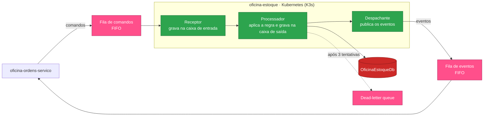

# oficina-estoque

Microsserviço de **peças, insumos, saldos e reservas** de estoque da solução **Oficina**.


---

## Sumário

- [Visão geral](#visão-geral)
- [Ordem de deploy da solução](#ordem-de-deploy-da-solução)
- [Arquitetura](#arquitetura)
- [Autenticação](#autenticação)
- [Endpoints](#endpoints)
- [O que consome e o que publica](#o-que-consome-e-o-que-publica)
- [Configuração](#configuração)
- [Como executar](#como-executar)
- [Validação](#validação)
- [Execução local](#execução-local)
- [Limitações conhecidas](#limitações-conhecidas)
- [Próxima etapa](#próxima-etapa)

---

## Visão geral

A **Oficina** é uma plataforma de gestão de oficina mecânica implantada na AWS e distribuída em **6 repositórios** que compõem um único sistema. O cliente acessa uma **API Gateway HTTP**, que autentica na borda por uma **Lambda authorizer** e encaminha o tráfego, via **VPC Link**, para um **ALB interno** que roteia para três microsserviços **.NET 10 em Kubernetes (K3s single-node numa EC2 privada)**. Os serviços se comunicam por HTTP interno e por filas **SQS FIFO**, e persistem em um **RDS SQL Server** compartilhado.

| Repositório | Responsabilidade | Etapas |
|---|---|:---:|
| [oficina-infra-db](https://github.com/fabianorodrigues/oficina-infra-db-fiap-fase4) | Rede, banco de dados, segredos e estado do Terraform | 1 e 3 |
| [oficina-infra](https://github.com/fabianorodrigues/oficina-infra-fiap-fase4) | Plataforma Kubernetes/ALB e entrada de API | 2 e 8 |
| [oficina-auth-lambda](https://github.com/fabianorodrigues/oficina-auth-lambda-fiap-fase4) | Autenticação por CPF e validação de token | 4 |
| [oficina-cadastro](https://github.com/fabianorodrigues/oficina-cadastro-fiap-fase4) | Clientes, veículos, funcionários e catálogo de serviços | 5 |
| **oficina-estoque** *(este)* | Peças, insumos, saldos e reservas | 6 |
| [oficina-ordens-servico](https://github.com/fabianorodrigues/oficina-ordens-servico-fiap-fase4) | Ordens de serviço, orçamento e saga de pagamento | 7 e 9 |

**Papel deste repositório:** gerencia o catálogo de peças e insumos, os saldos, as movimentações e as reservas. É o participante do lado do estoque na **saga distribuída**: recebe comandos de reserva das ordens de serviço e responde com eventos de resultado.

---

## Ordem de deploy da solução

| # | Repositório | Workflow | Confirmação |
|:---:|---|---|:---:|
| 1 | oficina-infra-db | Database Infrastructure Deploy | `APPLY` |
| 2 | oficina-infra | Platform Deploy | `APPLY` |
| 3 | oficina-infra-db | Database Bootstrap | `BOOTSTRAP` |
| 4 | oficina-auth-lambda | Auth Deploy | `DEPLOY` |
| 5 | oficina-cadastro | Cadastro Deploy | `DEPLOY` |
| **6** | **oficina-estoque** | **Estoque Deploy** | `DEPLOY` |
| 7 | oficina-ordens-servico | Ordens Deploy | `DEPLOY` |
| 8 | oficina-infra | Entrypoint Deploy | `APPLY` |
| 9 | oficina-ordens-servico | Collection Postman (execução manual) | — |

Após a etapa 8, o **Observability Validate** (oficina-infra) está disponível como validação **opcional**.

> [!IMPORTANT]
> Este é o segundo dos três serviços. Depende do cluster, do registro de imagem e das **filas SQS** criados na etapa 2, e do banco criado na etapa 3. Não há dependência de deploy entre as etapas 5, 6 e 7 — podem rodar em paralelo.

---

## Arquitetura

Combina uma API síncrona com um consumidor assíncrono, usando **caixa de entrada e caixa de saída** para garantir processamento exatamente uma vez e entrega confiável, mesmo com reentrega de mensagens.


```mermaid
flowchart LR
    Ordens["oficina-ordens-servico"] -->|"comandos"| FC["Fila de comandos<br/>FIFO"]

    subgraph Estoque["oficina-estoque · Kubernetes (K3s)"]
        direction TB
        R["Receptor<br/>grava na caixa de entrada"]
        P["Processador<br/>aplica a regra e grava na caixa de saída"]
        D["Despachante<br/>publica os eventos"]
        R --> P --> D
    end

    FC --> R
    P --> DB[("OficinaEstoqueDb")]
    D -->|"eventos"| FE["Fila de eventos<br/>FIFO"]
    FE --> Ordens
    P -.->|"após 3 tentativas"| DLQ["Dead-letter queue"]

    classDef svc fill:#2da44e,stroke:#166534,color:#fff
    classDef data fill:#CC2927,stroke:#7a1717,color:#fff
    classDef queue fill:#FF4F8B,stroke:#a11d55,color:#fff
    class R,P,D svc
    class DB data
    class FC,FE,DLQ queue
```

| Recebe | Publica |
|---|---|
| Reservar estoque | Estoque reservado · Reserva recusada |
| Liberar reserva de estoque | Reserva liberada · Falha ao liberar |

As mensagens são agrupadas pela ordem de serviço, o que preserva a ordem por ordem sem serializar o sistema inteiro. Mensagens de tipo desconhecido seguem para a *dead-letter queue*. Clean Architecture em quatro projetos: **Domain**, **Application**, **Infrastructure** (persistência e mensageria) e **Api**.

---

## Autenticação

O token é validado pelo autorizador da API Gateway, que devolve as *claims* à borda. A API Gateway as converte em cabeçalhos de identidade (`x-oficina-user-id`, `x-oficina-user-cpf`, `x-oficina-user-role`, `x-oficina-user-name`) e os injeta na requisição encaminhada.

Este serviço materializa esses cabeçalhos como *claims* e aplica as políticas de autorização por perfil; apenas `/health` e `/ready` são anônimos. O consumo de mensagens não passa pela camada HTTP e é autorizado pela identidade da task. Os cabeçalhos são confiáveis porque o ALB é interno e o acesso está restrito ao VPC Link. No perfil de desenvolvimento, um modo alternativo aceita cabeçalhos `X-Dev-*` — **ativado apenas em desenvolvimento**.

---

## Endpoints

| Método | Rota | Perfil |
|---|---|---|
| `GET` `POST` | `/api/pecas` | Funcionário ou administrador |
| `GET` `PUT` | `/api/pecas/{id}` | Funcionário ou administrador |
| `GET` `POST` | `/api/insumos` | Funcionário ou administrador |
| `GET` `PUT` | `/api/insumos/{id}` | Funcionário ou administrador |
| `GET` | `/api/estoque` | Funcionário ou administrador |
| `GET` | `/api/estoque/pecas/{id}` · `/api/estoque/insumos/{id}` | Funcionário ou administrador |
| `POST` | `/api/estoque/pecas/{id}/ajustar` · `/api/estoque/insumos/{id}/ajustar` | Funcionário ou administrador |
| `GET` | `/health` · `/ready` | Anônimo |

**Rotas internas**, consumidas apenas pelas ordens de serviço e **não publicadas na API Gateway**: consulta de disponibilidade e de materiais em lote.

> [!NOTE]
> `/ready` **verifica a conexão com o banco** e responde `503` quando ela falha. É esse endpoint que o *target group* do ALB usa como health check, então o destino só fica saudável com o serviço pronto para atender. `/health` continua refletindo apenas o processo.

---

## O que consome e o que publica

### Consome

| Valor | Origem | Criado por |
|---|---|---|
| Node do cluster e namespace | `/oficina/infra/k8s/instance-id` · `/oficina/infra/k8s/namespace` | oficina-infra |
| Registro de imagem, target group e NodePort | `/oficina/infra/ecr/estoque` · `/oficina/infra/services/estoque/{target-group-arn,node-port}` | oficina-infra |
| Filas de comandos e eventos + DLQs | `/oficina/infra/sqs/{estoque-comandos,ordens-eventos}[-dlq]/url` | oficina-infra |
| Credenciais de runtime e migração | `/oficina/estoque/{runtime,migration}-db` | oficina-infra-db |

As credenciais são lidas do Secrets Manager **dentro da EC2** e materializadas como **Secrets Kubernetes**, um para o Deployment e outro para o Migration Job; os endereços das filas vão no ConfigMap.

### Publica

O Deployment e o Service NodePort registrados no *target group* do ALB, os eventos de resultado de reserva nas filas e o esquema do banco de estoque, aplicado por um Migration Job nomeado com o commit SHA.

---

## Configuração

Configure em **Settings → Secrets and variables → Actions** do repositório.

| Tipo | Nome | Uso | Obrigatório |
|---|---|---|:---:|
| Secret | `AWS_ACCESS_KEY_ID` · `AWS_SECRET_ACCESS_KEY` · `AWS_SESSION_TOKEN` | Credenciais temporárias da AWS | **Sim** |
| Variable | `AWS_REGION` | Região dos recursos | **Sim** |
| Variable | `SONAR_PROJECT_KEY` · `SONAR_ORGANIZATION` | Projeto e organização no SonarCloud | Só com `SONAR_TOKEN` |
| Secret | `SONAR_TOKEN` | Token de análise do SonarCloud. Vazio ignora a análise; o gate local de cobertura continua valendo | Não |
| Variable | `TF_STATE_BUCKET` | Fallback do bucket que recebe o pacote de manifests | Não |

### Papéis IAM — não provisionados automaticamente

Nenhum workflow desta solução cria ou altera recursos IAM. O deploy não passa
role alguma: os Pods herdam a role do **instance profile da EC2 do cluster**,
configurada uma única vez em `oficina-infra` pela variável `INSTANCE_PROFILE_NAME`.

Essa role precisa permitir, no mínimo: registro no Systems Manager,
`ecr:GetAuthorizationToken` e pull das imagens, `secretsmanager:GetSecretValue`
nos segredos `/oficina/estoque/{runtime,migration}-db` e `ssm:GetParameter`
com `kms:Decrypt` em `/oficina/deploy/*`.

> [!NOTE]
> Sem IRSA e sem Pod Identity, todos os Pods do namespace compartilham essa role.
> O detalhe está registrado como risco em `docs/ARCHITECTURE.md`.
### Variáveis de ambiente da aplicação

Definidas pelo deploy no ConfigMap do namespace, com os endereços das filas resolvidos a partir do Systems Manager dentro da EC2.

| Chave | Valor no ambiente publicado |
|---|---|
| `ConnectionStrings__OficinaEstoqueDb` | Materializada como Secret Kubernetes dentro da EC2, a partir do Secrets Manager |
| `Messaging__Sqs__Enabled` | **Ativado** |
| `Messaging__Sqs__*QueueUrl` | Os quatro endereços de fila |
| `Messaging__Sqs__ConsumerConcurrency` · `MaxMessages` | Fixos em 1, para preservar a ordem |
| `Database__ApplyMigrations` | Desativado — migrações rodam em Migration Job próprio |

A aplicação recusa-se a iniciar fora de desenvolvimento se faltar a cadeia de conexão ou qualquer um dos quatro endereços de fila.

---

## Como executar

**Actions → Estoque Deploy → Run workflow → `confirmation` = `DEPLOY`**

Roda apenas na branch `main`. Sequência: valida a requisição → valida o contrato
oficial → **SonarCloud begin, quando configurado** → compila → testa com
cobertura → **gate local de 80%** → **SonarCloud end com Quality Gate, quando
configurado** → descobre registro de imagem, node,
target group e NodePort → constrói as imagens de runtime e de migração →
**varredura de vulnerabilidades, que interrompe o deploy em achado alto ou
crítico** → envia ao ECR → **Stage** (pacote de manifests transportado por URL
pré-assinada, com o Run Command recebendo apenas o nome de um SecureString e o
hash) → remove o objeto S3 e o SecureString → **Deploy** (pull das duas imagens,
ConfigMap, Secrets, Migration Job, Deployment, Service, rollout e capacidade do
node) → confirma o *target group* saudável.

As imagens são marcadas com o hash do commit. Se o Migration Job falhar, o Deployment e o Service não são aplicados.

---

## Validação

### Pelo Console AWS

| Serviço | O que verificar |
|---|---|
| **ECR** | Repositório de estoque com a imagem do commit publicado |
| **EC2 → Instâncias** | Node do cluster `running` e `Online` no Systems Manager |
| **SQS** | Fila de comandos com mensagens sendo consumidas e **DLQ vazia** |

Uma DLQ com mensagens é o principal sinal de falha deste serviço: indica comando que falhou três vezes ou de tipo desconhecido.

### Pela AWS CLI

<details>
<summary>Comandos de validação</summary>

```bash
REGIAO=<sua-regiao>
INSTANCIA=$(aws ssm get-parameter --name /oficina/infra/k8s/instance-id \
  --region "$REGIAO" --query 'Parameter.Value' --output text)

aws ssm describe-instance-information --filters "Key=InstanceIds,Values=$INSTANCIA" \
  --region "$REGIAO" --query 'InstanceInformationList[0].PingStatus' --output text

# Profundidade das filas: a DLQ deve permanecer em zero
for q in estoque-comandos estoque-comandos-dlq ordens-eventos ordens-eventos-dlq; do
  URL=$(aws ssm get-parameter --name "/oficina/infra/sqs/$q/url" \
    --region "$REGIAO" --query 'Parameter.Value' --output text 2>/dev/null) || continue
  echo -n "$q -> "
  aws sqs get-queue-attributes --queue-url "$URL" --region "$REGIAO" \
    --attribute-names ApproximateNumberOfMessages \
    --query 'Attributes.ApproximateNumberOfMessages' --output text
done
```

</details>

Após a **etapa 8**, a verificação de saúde também responde pela API pública, em `/health/estoque`.

---

## Execução local

O ambiente local completo — banco, filas emuladas e os três serviços — é orquestrado pelo repositório [oficina-ordens-servico](https://github.com/fabianorodrigues/oficina-ordens-servico-fiap-fase4), que constrói este serviço a partir do diretório vizinho e cria as filas FIFO no emulador. É o caminho recomendado para exercitar a saga de ponta a ponta.

Para trabalhar apenas neste repositório:

```bash
dotnet restore
dotnet build -c Release
dotnet test
```

Os testes cobrem regras de estoque, metadados de persistência e contratos públicos.

---

## Limitações conhecidas

- **Processamento estritamente serial.** Concorrência e lote fixos em 1 para preservar a ordem: consistência custa vazão.
- **Réplica única, sem escala automática**, por decisão de projeto — reforçada por verificação na CI.
- **Cobertura coletada, sem limite mínimo** de qualidade.
- **Sem reprocessamento automático da DLQ.** Mensagens que chegam lá exigem intervenção manual.

---

## Próxima etapa

**Etapa 7 — obrigatória.** Pré-condição: Deployment `oficina-estoque` disponível no cluster, Migration Job concluído com sucesso e a fila de comandos sendo consumida com a DLQ vazia.

**→ [oficina-ordens-servico](https://github.com/fabianorodrigues/oficina-ordens-servico-fiap-fase4)** — seção [Como executar](https://github.com/fabianorodrigues/oficina-ordens-servico-fiap-fase4#como-executar).

Com os três serviços no ar, siga para a **etapa 8** em [oficina-infra](https://github.com/fabianorodrigues/oficina-infra-fiap-fase4), que publica as rotas na API Gateway.

Para revisar a etapa anterior, volte a **[oficina-cadastro](https://github.com/fabianorodrigues/oficina-cadastro-fiap-fase4)** (etapa 5).
